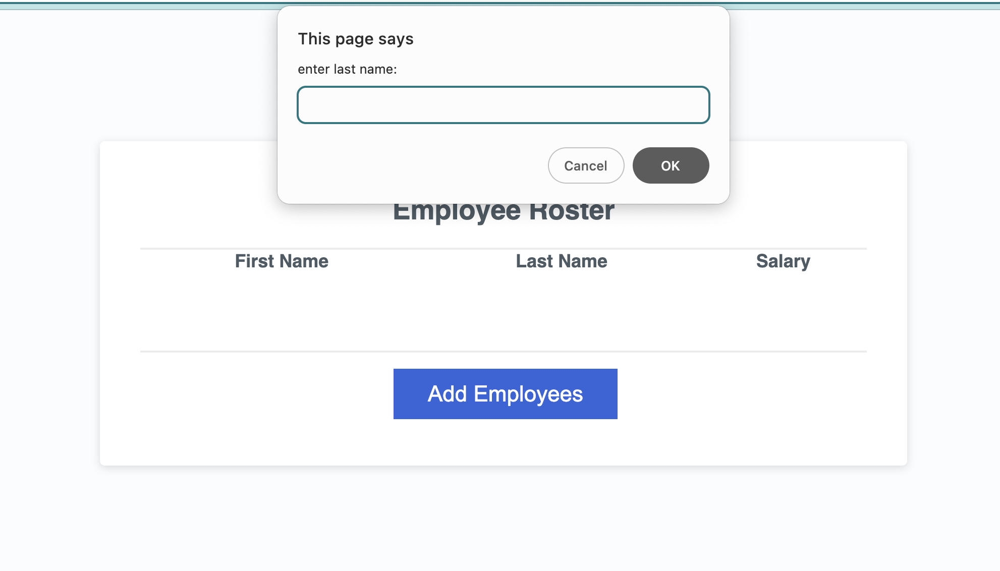

# Two-Employee-Tracker

## As a employee payroll tracker they want to keep track of payroll data
### When they clicked on "Add employer" button 
## where a series of prompts asking for first name, last name ,and salary
## when they finished adding employee 
## they were proopmted to add a new employee 
## when they choose to cancel 
## they are directed with employee dat displayed alphabetically by last name and the console data

